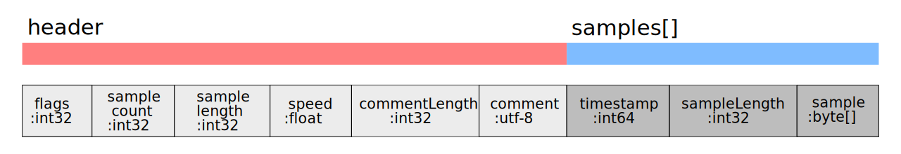

# seqosc
The idea of this project was to create a very simple protocol that defines the format on how to store recordings of [Open Sound Control](http://opensoundcontrol.org/introduction-osc) (OSC) packets. A difference to other OSC sequencer is that this format allows a recorder or player to work with OSC packets without interpreting them. This leads to a huge performance boost.

### Specification

The seqosc format consists of a header which specifies certain meta information about the sampled OSC data and a payload which contains the actual samples. Such a combination of header & samples is called `OSCBuffer`. The time resolution is currently limited to microseconds due to modern operating systems realtime limitations, but the timestamp could be also interpreted as nanosecond.

The data is in binary format with little-endian encoding. Please be aware that the header can expand and contain more fields, which currently are not defined.

#### Header

Only one header per file is allowed and every seqosc file has to start with the header. 

- flags (`int32`)
    - compression (`byte 0`) - if on payload is [compressed](#Compression) with delfate
- sample-count (`int32`) - how many samples are in the payload (`-1` tells the parser to iterate himself)
- sample-length (`int32`) - how long the payload is in bytes (used mainly for compression)
- speed (`float`) - intended speed to re-play the samples
- comment-length (`int32`) - length of the comment
- comment (`byte[]`) - comment data as utf-8 string

#### Samples

The samples part contains all OSC packet samples that have been recorded. The format of each samples is the exact binary transfered data that was sent by an OSC client.

- timestamp (`int64`) - timestamp in ms when the message have been received
- sampleLength (`int32`) - length of the next sample
- sample (`byte[]`) - raw OSC packet (bundle or message)

#### Compression

To minimize the data size of an `OSCBuffer` it is possible to add compression to the payload. The default method used is the [DEFLATE](https://en.wikipedia.org/wiki/DEFLATE) (zlib) compression which is common in most programming langauges. If a seqosc payload is compressed the compression flag in the header has to be turned on.

### About
Developed by cansik